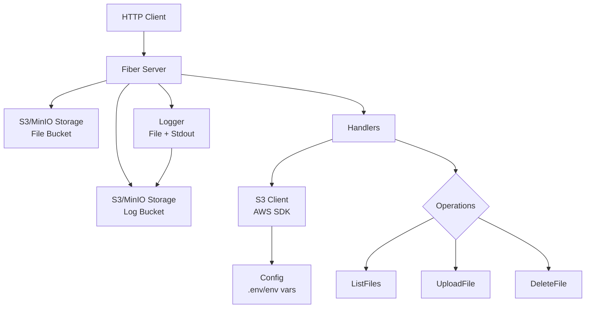
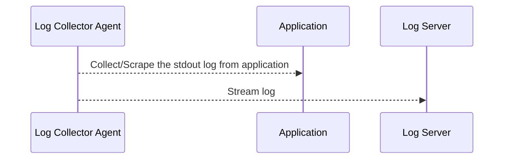

# Application Architecture

## Overview
The S3 File Manager API is a Go-based REST service for managing files in S3-compatible storage (e.g., MinIO). It provides endpoints for listing, uploading, and deleting files. Application logs are captured and uploaded to a designated S3 log bucket on application shutdown for persistence.

> [!CAUTION]
> Application should consider to use the log agent collector instead of use the application log uploading to S3

## Architecture Diagram

## Components

### Main (cmd/app/main.go)
- Entry point of the application
- Loads configuration
- Initializes S3 client
- Sets up logging to file and stdout
- Uploads log file to S3 log bucket on shutdown
- Starts the Fiber server

### Config (config/config.go)
- Manages application configuration
- Loads environment variables using envconfig
- Includes S3 endpoint, optional credentials (for MinIO/local), file bucket, log bucket, port

### Server (internal/server/server.go)
- Sets up Fiber web framework
- Configures middleware (logger, Prometheus metrics)
- Defines API routes
- Includes healthcheck and Swagger endpoints

### Handlers (internal/handlers/files.go)
- Contains business logic for file operations
- FileHandler struct with methods:
  - ListFiles: Retrieves file list from bucket
  - UploadFile: Handles file uploads
  - DeleteFile: Deletes files by key

### S3 Client (pkg/s3/s3.go)
- Wrapper around AWS SDK for Go
- Manages S3-compatible connections with auto-detection of AWS credentials (IAM roles, env vars, etc.)
- Provides methods for ListObjects, PutObject, DeleteObject, UploadToBucket

### Logging
- Application logs (including HTTP requests) are written to both stdout and a timestamped log file
- On application exit, the log file is uploaded to the configured S3 log bucket for persistence

## Data Flow
1. Client sends HTTP request to Fiber server
2. Request logged via Fiber middleware
3. Request routed to appropriate handler
4. Handler calls S3 client methods
5. S3 client communicates with storage service for file operations
6. Response sent back through the chain
7. On application shutdown, log file uploaded to S3 log bucket

## Technologies
- **Framework**: Fiber (Go web framework)
- **Storage**: S3-compatible (AWS SDK for Go)
- **Configuration**: Environment variables (envconfig)
- **Logging**: Multi-writer to stdout and file, uploaded to S3
- **Monitoring**: Prometheus metrics
- **Documentation**: Swagger/OpenAPI

> [!NOTE]
> This project should be setup in different architecture. The log collection should be able to setup like following architecture.

## Recommandation

