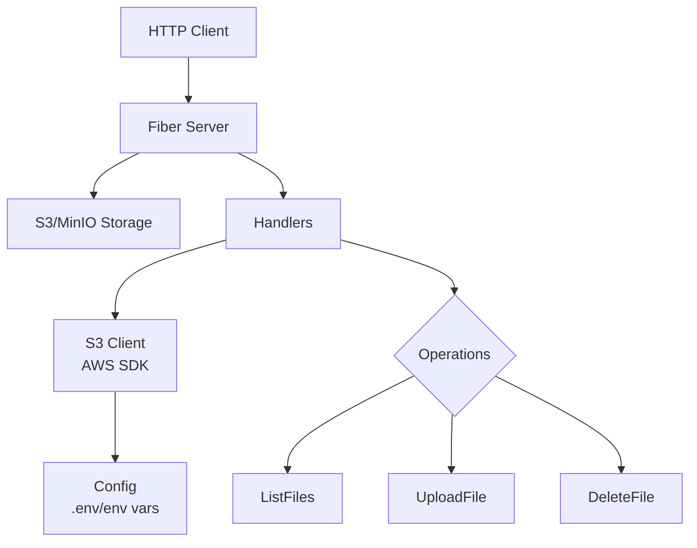

# Application Architecture

## Overview
The S3 File Manager API is a Go-based REST service for managing files in S3-compatible storage (e.g., MinIO). It provides endpoints for listing, uploading, and deleting files.

## Architecture Diagram

## Components

### Main (cmd/app/main.go)
- Entry point of the application
- Loads configuration
- Initializes S3 client
- Starts the Fiber server

### Config (config/config.go)
- Manages application configuration
- Loads environment variables from .env file or system env
- Includes S3 endpoint, credentials, bucket, port

### Server (internal/server/server.go)
- Sets up Fiber web framework
- Configures middleware (logger, Prometheus metrics)
- Defines API routes
- Includes healthcheck and Swagger endpoints

### Handlers (internal/handlers/files.go)
- Contains business logic for file operations
- FileHandler struct with methods:
  - ListFiles: Retrieves file list from bucket
  - UploadFile: Handles file uploads
  - DeleteFile: Deletes files by key

### S3 Client (pkg/s3/s3.go)
- Wrapper around AWS SDK for Go
- Manages S3-compatible connections
- Provides methods for ListObjects, PutObject, DeleteObject

## Data Flow
1. Client sends HTTP request to Fiber server
2. Request routed to appropriate handler
3. Handler calls S3 client methods
4. S3 client communicates with storage service
5. Response sent back through the chain

## Technologies
- **Framework**: Fiber (Go web framework)
- **Storage**: S3-compatible (AWS SDK for Go)
- **Configuration**: Environment variables with .env support
- **Monitoring**: Prometheus metrics
- **Documentation**: Swagger/OpenAPI