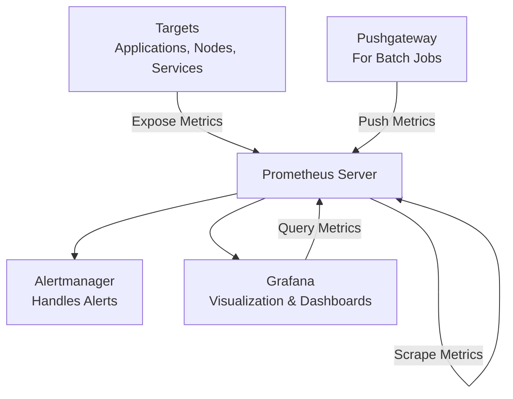
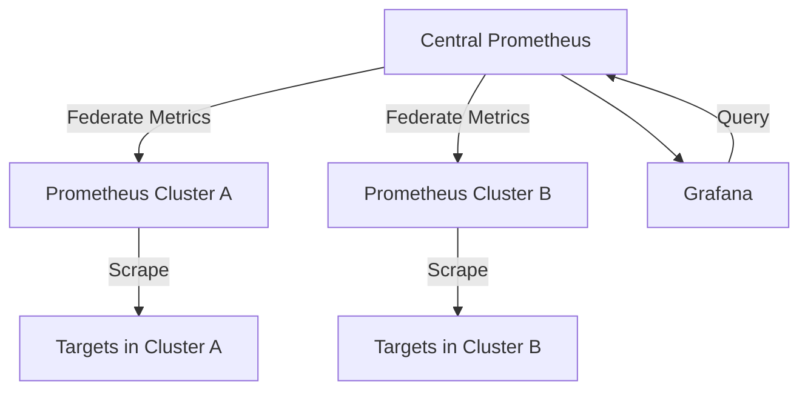

# Prometheus

Prometheus is metrics tool to monitor the metrics of the resources by scraping the metrics from target host.

> [!NOTE]
> This node exporter (docker machine host)

## Architecture

> ![NOTE]
> Improvement of production setup and kubernetes integration.

## Improvements

### Deploying Prometheus on Kubernetes
Deploy Prometheus as a Kubernetes deployment for scalability and reliability. Use Helm charts like kube-prometheus-stack for easy setup, including Prometheus Operator for managing Prometheus instances.

### Using Kubernetes Service Discovery
Leverage Kubernetes service discovery to automatically find and scrape metrics from pods, services, and endpoints. Configure Prometheus with kubernetes_sd_configs to monitor dynamic workloads without manual target configuration.

### Centralized Prometheus with Federation
Use Prometheus federation to aggregate metrics from multiple Prometheus instances across clusters. A central Prometheus pulls metrics from regional instances, enabling global monitoring while reducing load on individual clusters.

### Federated Architecture Diagram

