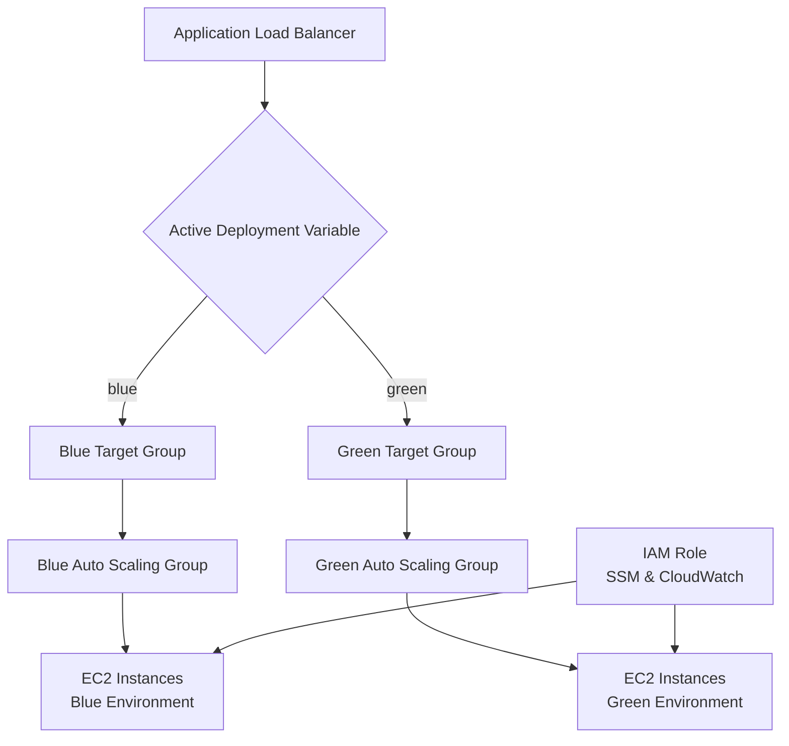

# Blue/Green Deployment Architecture

## Overview
Blue/green deployment is a strategy that reduces downtime and risk by running two identical environments (blue and green). Traffic is routed to one environment at a time, allowing seamless switching between versions.

## Architecture in This Module
- **Application Load Balancer (ALB)**: Routes incoming traffic to the active environment.
- **Target Groups**: Two groups (blue and green) register healthy EC2 instances.
- **Auto Scaling Groups (ASGs)**: Separate ASGs for blue and green deployments, each attached to their respective target group.
- **EC2 Instances**: Launched via launch templates, managed by ASGs, with IAM roles for S3 access.

## Deployment Process
1. **Prepare Green Environment**: Update launch template with new AMI/code. Scale green ASG to desired capacity.
2. **Test Green**: Verify green instances are healthy via target group health checks.
3. **Switch Traffic**: Change `active_deployment` variable to "green" to route ALB traffic to green target group.
4. **Monitor**: Ensure green environment performs well.
5. **Cleanup**: Scale blue ASG to zero or redeploy blue with new version for next deployment.

## Benefits
- Zero-downtime deployments
- Easy rollback by switching back to blue
- Isolated testing of new versions
- Improved reliability and user experience

## Configuration
Use the `active_deployment` variable ("blue" or "green") to control traffic routing. Adjust ASG sizes via `*_min_size`, `*_max_size`, and `*_desired_capacity` variables.

## Architecture Diagram
